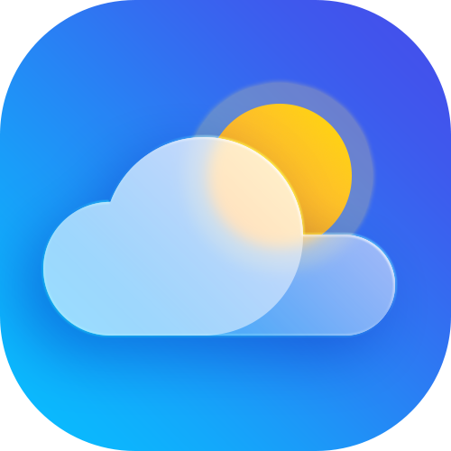

  

# WeatherWatcher

WeatherWatcher is an Android weather application that allows users to create an account, search for current weather data, view weather details for different locations, and manage activities such as pinned locations and a recent search history.

This app was created as a final project for **CST 338: Software Design** at **California State University, Monterey Bay**.

## Team Members

- William Casey — `wCaseyCSUMB`
- Josue Nava — `jnav06`
- Oliver Liu — `Awesomeuno`

## Features

- Account system: Username and password to login + account creation
- Current weather display for a user's specific location (asks for users location with a pop-up)
- Search feature to look up cities by name
- Weather details including temperature, humidity, wind speed, and conditions
- Taskbar with sections for pinned cities and recent search history
- Administrator role to remove users

## Technology

- **Language:** Java
- **APIs:** OpenWeather, Retrofit

## API Usage

WeatherWatcher uses the OpenWeather API to retrieve weather data and display it inside the app.

The following data is utilized:
- City information
- Temperature
- Weather conditions
- Feels-like temperature
- High and low temperature
- Humidity
- Wind speed
